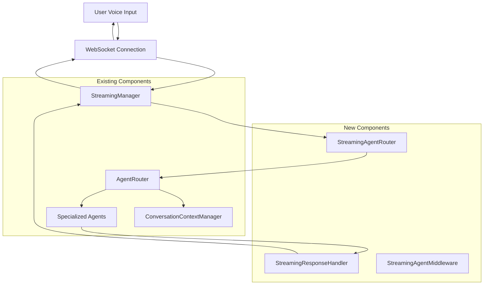

# Design Document

## Overview

This design document outlines the integration of the existing agent routing system with the streaming mode functionality. The current system has two distinct modes:

1. **Batch Mode**: Uses sophisticated agent routing with `AgentRouter`, `ConversationContextManager`, and specialized agents (FraudAgent, PaymentsAgent, IDVAgent, BankingInfoAgent)
2. **Streaming Mode**: Direct integration with OpenAI Realtime API via `StreamingManager` for low-latency voice conversations

The integration will create a hybrid system that brings the intelligence of agent routing to streaming conversations while maintaining the real-time performance characteristics that users expect.

## Architecture

### High-Level Architecture



### Component Integration Flow

1. **Message Interception**: `StreamingManager` intercepts transcribed messages before sending to OpenAI
2. **Agent Routing**: `StreamingAgentRouter` routes messages through existing `AgentRouter` logic
3. **Session Updates**: Dynamic session instruction updates via WebSocket `session.update` messages
4. **Response Handling**: `StreamingResponseHandler` processes agent responses for streaming delivery
5. **Context Management**: Enhanced `ConversationContextManager` for streaming session persistence

## Components and Interfaces

### StreamingAgentRouter

**Purpose**: Bridge between streaming WebSocket messages and existing agent routing logic

**Key Methods**:
```javascript
class StreamingAgentRouter {
    constructor(agentRouter, streamingManager)
    
    // Route transcribed message through agent system
    async routeStreamingMessage(transcript, sessionContext)
    
    // Update OpenAI session with agent-specific instructions
    async updateSessionForAgent(agent, context)
    
    // Handle agent switching during streaming session
    async switchAgent(newAgent, currentContext)
    
    // Get streaming-compatible agent response
    async getStreamingResponse(agent, input, context)
}
```

**Integration Points**:
- Extends existing `AgentRouter` functionality
- Integrates with `StreamingManager` message handling
- Uses `ConversationContextManager` for session state

### StreamingResponseHandler

**Purpose**: Convert agent responses into streaming-compatible format

**Key Methods**:
```javascript
class StreamingResponseHandler {
    constructor(streamingManager)
    
    // Process agent response for streaming delivery
    async processAgentResponse(agentResponse, streamingContext)
    
    // Chunk response for real-time delivery
    chunkResponseForStreaming(response, chunkSize)
    
    // Handle voice configuration for agent responses
    configureAgentVoice(agent, sessionConfig)
    
    // Format response for WebSocket transmission
    formatForWebSocket(response, messageType)
}
```

### StreamingAgentMiddleware

**Purpose**: WebSocket middleware layer for agent routing integration

**Key Methods**:
```javascript
class StreamingAgentMiddleware {
    constructor(streamingManager, streamingAgentRouter)
    
    // Intercept WebSocket messages for routing
    interceptMessage(message, messageType)
    
    // Handle routing errors gracefully
    handleRoutingError(error, fallbackResponse)
    
    // Manage agent state during WebSocket session
    manageAgentState(sessionId, agentName, state)
}
```

### Enhanced StreamingManager Integration

**Modified Methods**:
```javascript
// In StreamingManager class
handleMessage(event) {
    // ... existing code ...
    
    case 'conversation.item.input_audio_transcription.completed':
        // NEW: Route through agent system before OpenAI response
        if (this.agentRoutingEnabled) {
            await this.routeThroughAgents(message.transcript);
            return; // Skip default OpenAI response generation
        }
        // ... existing transcription handling ...
        break;
}

// NEW: Agent routing integration
async routeThroughAgents(transcript) {
    const routingResult = await this.streamingAgentRouter.routeStreamingMessage(
        transcript, 
        this.getSessionContext()
    );
    
    if (routingResult.success) {
        await this.updateSessionWithAgentResponse(routingResult);
    } else {
        // Fallback to standard streaming
        this.handleTranscriptionFallback(transcript);
    }
}
```

## Data Models

### StreamingSessionContext

```javascript
{
    sessionId: string,
    currentAgent: string | null,
    agentHistory: Array<{
        agentName: string,
        timestamp: number,
        switchReason: string
    }>,
    conversationContext: Object,
    voiceConfiguration: {
        currentVoice: string,
        agentVoices: Map<string, string>
    },
    routingMetrics: {
        routingLatency: number,
        agentSwitches: number,
        fallbackCount: number
    }
}
```

### AgentStreamingResponse

```javascript
{
    success: boolean,
    response: string,
    agentName: string,
    streamingInstructions: string,
    voiceConfig: Object,
    metadata: {
        processingTime: number,
        tokensUsed: number,
        requiresSessionUpdate: boolean,
        chunkingStrategy: string
    }
}
```

### StreamingRoutingDecision

```javascript
{
    selectedAgent: BaseAgent | null,
    confidence: number,
    routingReason: string,
    sessionUpdateRequired: boolean,
    voiceChangeRequired: boolean,
    fallbackStrategy: string,
    contextPreservation: Object
}
```

## Error Handling

### Routing Error Scenarios

1. **Agent Routing Timeout**: If routing takes >100ms, fallback to standard streaming
2. **Agent Processing Error**: Graceful degradation to fallback handler
3. **Session Update Failure**: Retry with exponential backoff, fallback if persistent
4. **WebSocket Disconnection**: Preserve agent context for reconnection
5. **Agent Switching Error**: Continue with current agent, log error

### Fallback Strategies

```javascript
const FallbackStrategies = {
    ROUTING_TIMEOUT: 'Continue with standard streaming',
    AGENT_ERROR: 'Use FallbackHandler response',
    SESSION_UPDATE_FAILED: 'Retry up to 3 times, then continue',
    WEBSOCKET_ERROR: 'Preserve state for reconnection',
    CRITICAL_FAILURE: 'Disable agent routing, continue streaming'
};
```

### Error Recovery Mechanisms

1. **Circuit Breaker Pattern**: Temporarily disable agent routing if error rate exceeds threshold
2. **Graceful Degradation**: Always maintain basic streaming functionality
3. **State Recovery**: Restore agent context after WebSocket reconnection
4. **Performance Monitoring**: Track routing latency and disable if too slow

## Testing Strategy

### Unit Testing

1. **StreamingAgentRouter Tests**:
   - Message routing accuracy
   - Session update generation
   - Agent switching logic
   - Error handling scenarios

2. **StreamingResponseHandler Tests**:
   - Response formatting
   - Chunking strategies
   - Voice configuration
   - WebSocket message generation

3. **Integration Tests**:
   - End-to-end message flow
   - Agent switching scenarios
   - Error recovery mechanisms
   - Performance benchmarks

### Performance Testing

1. **Latency Benchmarks**:
   - Routing decision time (<100ms target)
   - Session update latency
   - Agent switching overhead
   - Overall response time impact

2. **Load Testing**:
   - Concurrent streaming sessions
   - Agent routing under load
   - Memory usage patterns
   - WebSocket connection stability

3. **Stress Testing**:
   - Rapid agent switching
   - Error injection scenarios
   - Resource exhaustion handling
   - Recovery time measurement

### Integration Testing Scenarios

1. **Happy Path**: Successful agent routing and response generation
2. **Agent Switching**: Mid-conversation agent changes
3. **Error Recovery**: Various failure modes and recovery
4. **Performance**: Latency and throughput under normal conditions
5. **Fallback**: Graceful degradation when routing fails

## Implementation Phases

### Phase 1: Core Infrastructure (Tasks 1.1-1.2)
- Create `StreamingAgentRouter` class
- Implement basic message interception
- Design session update mechanism
- Basic error handling framework

### Phase 2: Agent Integration (Tasks 2.1-2.3)
- Modify `StreamingManager` message handling
- Implement agent-specific session management
- Create `StreamingResponseHandler`
- Context preservation logic

### Phase 3: Advanced Features (Tasks 3.1-4.2)
- Enhanced conversation context management
- WebSocket middleware implementation
- Dynamic session updates
- Agent switching optimization

### Phase 4: User Experience (Tasks 5.1-6.2)
- Response generation optimization
- Voice integration
- UI updates for agent awareness
- Debug panel enhancements

### Phase 5: Production Readiness (Tasks 7.1-10.2)
- Comprehensive error handling
- Performance optimization
- Configuration management
- Documentation and deployment

## Performance Considerations

### Latency Optimization

1. **Routing Cache**: Cache recent routing decisions to avoid repeated AI calls
2. **Parallel Processing**: Route while OpenAI processes audio
3. **Preemptive Loading**: Prepare agent contexts before switching
4. **Minimal Session Updates**: Only update when agent actually changes

### Memory Management

1. **Context Cleanup**: Regular cleanup of old conversation context
2. **Agent State Management**: Efficient storage of agent-specific state
3. **WebSocket Buffer Management**: Proper handling of message queues
4. **Resource Pooling**: Reuse objects where possible

### Scalability Considerations

1. **Stateless Design**: Minimize server-side state storage
2. **Connection Pooling**: Efficient WebSocket connection management
3. **Load Balancing**: Support for multiple streaming instances
4. **Monitoring**: Comprehensive metrics for performance tracking

## Security Considerations

### Agent Sandboxing

1. **API Client Sandboxing**: Each agent gets sandboxed API access
2. **Context Isolation**: Agent contexts are isolated from each other
3. **Permission Management**: Agents have limited system access
4. **Input Validation**: All user inputs are validated before routing

### Data Protection

1. **Conversation Privacy**: Secure handling of conversation data
2. **Agent Context Security**: Encrypted storage of sensitive context
3. **WebSocket Security**: Secure WebSocket connections
4. **Audit Logging**: Comprehensive logging for security analysis

## Monitoring and Observability

### Key Metrics

1. **Routing Performance**: Decision time, accuracy, fallback rate
2. **Agent Performance**: Response time, success rate, error rate
3. **User Experience**: End-to-end latency, conversation quality
4. **System Health**: Resource usage, connection stability

### Logging Strategy

1. **Structured Logging**: JSON-formatted logs with consistent schema
2. **Correlation IDs**: Track requests across components
3. **Performance Logs**: Detailed timing information
4. **Error Context**: Rich error information for debugging

### Alerting

1. **Performance Degradation**: Alert when latency exceeds thresholds
2. **Error Rate Spikes**: Alert on increased error rates
3. **Agent Failures**: Alert when specific agents fail repeatedly
4. **System Resource**: Alert on memory/CPU usage issues