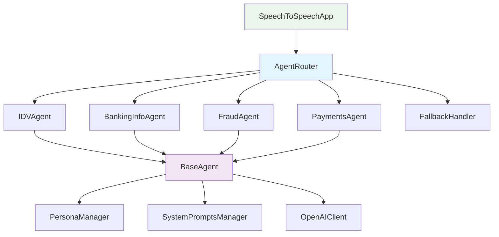

# Design Document

## Overview

The Agent Architecture feature introduces a modular, domain-specific routing system to the existing Voice Banking Assistant. The system will intercept user input after speech-to-text conversion and route requests to specialized agents based on content analysis. Each agent will handle specific banking domains (Identity & Verification, Banking Information, Fraud Detection, and Payments) while maintaining security boundaries and integrating seamlessly with the existing persona system.

## Architecture

### High-Level Flow
```
User Voice Input → Whisper STT → AgentRouter → Domain Agent → LLM Processing → TTS → User
```

### Integration Points
The agent system integrates with the existing `SpeechToSpeechApp` class at the following points:

1. **Post-STT Integration**: After `speechToText()` completes, the transcribed text is sent to `AgentRouter`
2. **Pre-GPT Replacement**: The agent's `handle()` method replaces the current `generateResponse()` call
3. **Persona Compatibility**: Agents can access and supplement the current persona data
4. **System Prompt Integration**: Agents can modify or extend system prompts for domain-specific context

### Component Architecture



## Components and Interfaces

### BaseAgent Class
```javascript
class BaseAgent {
    constructor(name, description) {
        this.name = name;
        this.description = description;
        this.debug = window.debugManager.createModuleLogger(`Agent:${name}`);
    }
    
    // Abstract methods to be implemented by subclasses
    canHandle(inputText) { throw new Error('Must implement canHandle()'); }
    async handle(inputText, context) { throw new Error('Must implement handle()'); }
    
    // Optional telemetry hooks
    onActivate() { /* Override if needed */ }
    onComplete(result) { /* Override if needed */ }
    
    // Helper methods
    getPersonaData(context) { return context.personaManager.getCurrentPersonaData(); }
    generateSystemPrompt(context, userInput) { /* Default implementation */ }
}
```

### AgentRouter Class
```javascript
class AgentRouter {
    constructor(agents = []) {
        this.agents = agents;
        this.fallbackHandler = new FallbackHandler();
        this.debug = window.debugManager.createModuleLogger('AgentRouter');
    }
    
    async route(inputText, context) {
        // Find the most appropriate agent
        const agent = this.findBestAgent(inputText);
        
        if (agent) {
            agent.onActivate();
            const result = await agent.handle(inputText, context);
            agent.onComplete(result);
            return result;
        }
        
        // Fallback to default behavior
        return this.fallbackHandler.handle(inputText, context);
    }
    
    findBestAgent(inputText) {
        // Priority-based routing - first match wins
        return this.agents.find(agent => agent.canHandle(inputText));
    }
}
```

### Domain-Specific Agents

#### IDVAgent (Identity & Verification)
- **Triggers**: "verify me", "forgot password", "reset PIN", "identity check"
- **Capabilities**: Account verification, password reset guidance, security questions
- **Data Access**: Identity verification functions only
- **Security**: Cannot access payment or transaction data

#### BankingInfoAgent (Banking Information)
- **Triggers**: "balance", "transactions", "account details", "statement"
- **Capabilities**: Balance inquiries, transaction history, account information
- **Data Access**: Read-only access to account and transaction data
- **Security**: Cannot perform transactions or modifications

#### FraudAgent (Fraud Detection & Security)
- **Triggers**: "freeze card", "unauthorised", "suspicious", "fraud", "block card"
- **Capabilities**: Card blocking, fraud reporting, security alerts
- **Data Access**: Security and fraud-related functions
- **Security**: Can perform protective actions but not financial transactions

#### PaymentsAgent (Payment Processing)
- **Triggers**: "send money", "transfer", "pay", "£[amount]", "payment"
- **Capabilities**: Money transfers, payment processing, transaction initiation
- **Data Access**: Payment and transfer functions
- **Security**: Highest security level with transaction validation

## Data Models

### Agent Context
```javascript
const AgentContext = {
    personaManager: PersonaManager,
    systemPromptsManager: SystemPromptsManager,
    apiClient: OpenAIClient,
    tokenTracker: TokenTracker,
    currentPersona: String,
    sessionData: Object,
    debugMode: Boolean
};
```

### Agent Response
```javascript
const AgentResponse = {
    success: Boolean,
    response: String,
    agentName: String,
    processingTime: Number,
    tokensUsed: Number,
    error: String | null,
    metadata: Object
};
```

### Agent Configuration
```javascript
const AgentConfig = {
    name: String,
    description: String,
    priority: Number,
    enabled: Boolean,
    triggers: Array<String>,
    llmProvider: String, // 'openai', 'claude', 'bedrock'
    llmModel: String,
    systemPromptOverride: String | null,
    telemetryEnabled: Boolean
};
```

## Error Handling

### Agent-Level Error Handling
- Each agent implements try-catch blocks around LLM calls
- Failed agents return structured error responses
- Router automatically falls back to default handler on agent failure
- All errors are logged with agent context for debugging

### Security Error Handling
- Domain boundary violations are caught and logged
- Unauthorized data access attempts trigger security alerts
- API sandboxing prevents cross-domain data leakage
- Failed security checks result in safe fallback responses

### Graceful Degradation
- If AgentRouter fails, system falls back to original `generateResponse()` method
- Individual agent failures don't break the entire conversation flow
- Network issues with specific LLM providers trigger fallback to default OpenAI

## Testing Strategy

### Unit Testing
- Test each agent's `canHandle()` method with various input patterns
- Verify `handle()` method responses for domain-specific scenarios
- Mock external dependencies (OpenAI API, PersonaManager)
- Test error handling and edge cases

### Integration Testing
- Test AgentRouter with multiple agents and priority handling
- Verify seamless integration with existing SpeechToSpeechApp flow
- Test persona compatibility and system prompt integration
- Validate security boundaries between agents

### End-to-End Testing
- Test complete voice-to-voice flows through different agents
- Verify agent switching within single conversations
- Test streaming mode compatibility with agent routing
- Validate token tracking across different agents

### Security Testing
- Attempt cross-domain data access between agents
- Test API sandboxing and permission boundaries
- Verify that agents cannot access unauthorized functions
- Test malicious input handling and sanitization

## Performance Considerations

### Routing Efficiency
- Agent selection uses simple pattern matching for fast routing
- Priority-based ordering minimizes unnecessary `canHandle()` calls
- Caching of agent decisions for repeated similar inputs

### Memory Management
- Agents are instantiated once and reused across requests
- Context objects are passed by reference to avoid copying
- Cleanup of agent state between requests

### Token Optimization
- Each agent can specify optimal LLM models for their domain
- Shorter, domain-specific system prompts reduce token usage
- Agent-specific token tracking for cost optimization

## Future Extensibility

### LLM Provider Integration
```javascript
// Pluggable LLM backend support
class AgentLLMProvider {
    async generateResponse(prompt, config) {
        switch(config.provider) {
            case 'openai': return this.callOpenAI(prompt, config);
            case 'claude': return this.callClaude(prompt, config);
            case 'bedrock': return this.callBedrock(prompt, config);
        }
    }
}
```

### Telemetry Hooks
```javascript
// Optional telemetry integration
class AgentTelemetry {
    onAgentActivated(agentName, inputText) { /* Track usage */ }
    onAgentCompleted(agentName, response, metrics) { /* Track performance */ }
    onAgentError(agentName, error, context) { /* Track failures */ }
}
```

### Dynamic Agent Loading
- Support for loading agents from external modules
- Runtime agent registration and deregistration
- Configuration-driven agent enabling/disabling

### Advanced Routing
- Machine learning-based agent selection
- Context-aware routing based on conversation history
- Multi-agent collaboration for complex requests