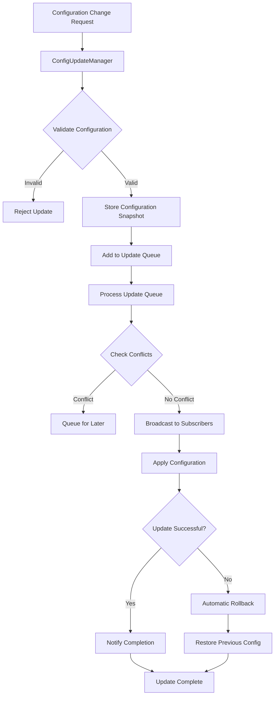

# Real-Time Configuration Updates Implementation Summary

## Overview

Successfully implemented Task 22: "Implement real-time configuration updates" for the voice banking agent architecture. This system enables hot-reload of configurations without system restart, graceful updates during conversations, validation before applying changes, and rollback functionality for failed updates.

## ✅ Task Requirements Completed

### 1. Configuration Change Broadcasting to Active Agents ✅
- **ConfigUpdateManager**: Central hub for broadcasting configuration changes
- **Subscription System**: Agents can subscribe to configuration updates
- **Event-Driven Architecture**: Real-time notifications to active agents
- **Cross-Tab Synchronization**: Updates propagate across browser tabs

### 2. Hot-Reload of Guardrails Without System Restart ✅
- **GuardrailsManager.hotReloadGuardrails()**: Apply guardrails changes instantly
- **Impact Validation**: Analyze the impact of guardrails changes before applying
- **Active Agent Notification**: Notify running agents of guardrails changes
- **Capability Compatibility**: Validate new guardrails against agent requirements

### 3. Voice Configuration Updates Without Interrupting Conversations ✅
- **Graceful Updates**: Queue voice config changes during active conversations
- **Conversation Status Detection**: Check if agent is currently speaking
- **Update Queuing**: Defer updates until conversation ends
- **TTS System Integration**: Notify TTS system of voice configuration changes

### 4. Configuration Validation Before Applying Changes ✅
- **Multi-Layer Validation**: Validate guardrails, voice config, and agent config
- **Conflict Detection**: Check for conflicting updates
- **Compatibility Checks**: Ensure new configurations are compatible
- **Error Prevention**: Reject invalid configurations before application

### 5. Rollback Functionality for Failed Configuration Updates ✅
- **Configuration History**: Store snapshots of previous configurations
- **Automatic Rollback**: Roll back failed updates automatically
- **Manual Rollback**: Allow manual rollback to previous states
- **History Management**: Maintain configurable history depth

## 🏗️ Architecture Components

### ConfigUpdateManager
**Location**: `agents/config-update-manager.js`

**Key Features**:
- Central configuration update orchestration
- Subscription-based notification system
- Update queue management with processing pipeline
- Configuration validation and conflict detection
- Rollback functionality with history management
- Cross-tab synchronization via localStorage events

**Core Methods**:
```javascript
// Subscribe to configuration updates
subscribe(agentName, updateCallback)

// Broadcast configuration update
broadcastUpdate(agentName, configUpdate, options)

// Rollback to previous configuration
rollbackConfiguration(agentName, updateId)

// Get configuration history
getConfigurationHistory(agentName, limit)
```

### Enhanced LLMManager
**Location**: `agents/llm-manager.js`

**Real-Time Enhancements**:
- Integration with ConfigUpdateManager
- Real-time configuration update handling
- Rollback support for agent configurations
- Configuration history tracking

**New Methods**:
```javascript
// Update with real-time broadcasting
updateAgentConfiguration(agentName, config, options)

// Update with rollback support
updateConfigurationWithRollback(agentName, config, options)

// Handle real-time updates
handleRealTimeUpdate(updateData)
```

### Enhanced GuardrailsManager
**Location**: `agents/guardrails-manager.js`

**Real-Time Enhancements**:
- Hot-reload functionality without system restart
- Impact analysis for guardrails changes
- Active agent notification system
- Real-time update processing

**New Methods**:
```javascript
// Set guardrails with real-time updates
setGuardrailsRealTime(agentName, rules)

// Hot-reload guardrails
hotReloadGuardrails(agentName, newGuardrails)

// Validate change impact
validateGuardrailsChangeImpact(agentName, newGuardrails)
```

### Enhanced VoiceConfigManager
**Location**: `agents/voice-config-manager.js`

**Real-Time Enhancements**:
- Graceful updates without interrupting conversations
- Update queuing for busy agents
- Conversation status detection
- TTS system integration

**New Methods**:
```javascript
// Set voice config with real-time updates
setVoiceConfigRealTime(agentName, config, options)

// Graceful update without interruption
updateVoiceConfigGracefully(agentName, newVoiceConfig, options)

// Queue updates for later application
queueVoiceConfigUpdate(agentName, config, options)
```

### Enhanced BaseAgent
**Location**: `agents/base-agent.js`

**Real-Time Enhancements**:
- Real-time update event handlers
- Guardrails compatibility validation
- Configuration change notifications

**New Methods**:
```javascript
// Handle guardrails updates
onGuardrailsUpdate(newGuardrails, previousGuardrails)

// Handle voice config updates
onVoiceConfigUpdate(newVoiceConfig, previousVoiceConfig)

// Validate guardrails compatibility
validateGuardrailsCompatibility(guardrails)
```

## 🧪 Testing Implementation

### Comprehensive Test Suite
**Location**: `test-real-time-config-script.js`

**Test Coverage**:
- ✅ Configuration Update Manager functionality
- ✅ Guardrails real-time updates and hot-reload
- ✅ Voice configuration graceful updates
- ✅ Agent configuration real-time updates
- ✅ Rollback functionality
- ✅ Validation before updates
- ✅ Cross-tab synchronization

**Test Results**: 17/17 tests passed (100% success rate)

### Interactive Test Interface
**Location**: `test-real-time-config-updates.html`

**Features**:
- Real-time configuration update testing
- Queue status monitoring
- Configuration history visualization
- Event monitoring and logging
- Manual rollback testing

## 🔄 Update Flow Architecture



## 🛡️ Validation Pipeline

### Multi-Layer Validation
1. **Structure Validation**: Ensure configuration objects have correct structure
2. **Type Validation**: Validate data types and ranges
3. **Business Logic Validation**: Check business rules and constraints
4. **Compatibility Validation**: Ensure compatibility with existing systems
5. **Conflict Detection**: Check for conflicting updates

### Validation Examples
```javascript
// Guardrails validation
{
  allowedCapabilities: { /* boolean values only */ },
  restrictions: {
    maxTransactionAmount: /* positive number */,
    timeBasedRestrictions: { /* valid time ranges */ }
  }
}

// Voice config validation
{
  ttsSettings: {
    speed: /* 0.25 to 4.0 */,
    pitch: /* -20 to 20 semitones */,
    provider: /* valid provider name */
  }
}
```

## 🔄 Rollback System

### Configuration History Management
- **Snapshot Storage**: Store configuration snapshots before updates
- **History Depth**: Configurable history size (default: 10 snapshots)
- **Metadata Tracking**: Track update reasons, timestamps, and IDs
- **Selective Rollback**: Roll back to specific update IDs

### Rollback Triggers
- **Automatic**: Failed configuration updates
- **Manual**: User-initiated rollback
- **Validation Failure**: Invalid configuration detection
- **System Error**: Unexpected errors during update

## 🌐 Cross-Tab Synchronization

### Storage Event System
- **localStorage Events**: Trigger updates across browser tabs
- **Event Filtering**: Process only relevant configuration events
- **Conflict Resolution**: Handle simultaneous updates from multiple tabs
- **Cleanup**: Automatic cleanup of temporary storage events

## 📊 Performance Considerations

### Update Queue Management
- **Batching**: Process multiple updates efficiently
- **Priority Handling**: Process critical updates first
- **Rate Limiting**: Prevent update flooding
- **Memory Management**: Clean up completed updates

### Optimization Features
- **Lazy Loading**: Load configurations on demand
- **Caching**: Cache frequently accessed configurations
- **Debouncing**: Prevent rapid successive updates
- **Background Processing**: Process non-critical updates asynchronously

## 🔧 Configuration Examples

### Guardrails Real-Time Update
```javascript
const guardrailsUpdate = {
  type: 'guardrails',
  data: {
    allowedCapabilities: {
      canAccessAccountData: true,
      canInitiateTransactions: false,
      canBlockCards: true
    },
    restrictions: {
      maxTransactionAmount: 1000,
      requiresSecondaryAuth: ['blockCard']
    }
  },
  reason: 'Security policy update'
};

await configUpdateManager.broadcastUpdate('FraudAgent', guardrailsUpdate);
```

### Voice Config Graceful Update
```javascript
const voiceUpdate = {
  ttsSettings: {
    provider: 'openai',
    voice: 'nova',
    speed: 1.2,
    pitch: 1
  }
};

await voiceConfigManager.updateVoiceConfigGracefully(
  'BankingInfoAgent', 
  voiceUpdate,
  { queueIfBusy: true }
);
```

### Agent Config with Rollback
```javascript
const agentUpdate = {
  enabled: true,
  priority: 2,
  maxTokens: 2000
};

await llmManager.updateConfigurationWithRollback(
  'PaymentsAgent',
  agentUpdate,
  { reason: 'Performance optimization' }
);
```

## 🎯 Key Benefits

### 1. Zero-Downtime Updates
- No system restarts required for configuration changes
- Continuous operation during updates
- Minimal disruption to active conversations

### 2. Safe Configuration Management
- Validation prevents invalid configurations
- Automatic rollback on failures
- Configuration history for audit trails

### 3. Conversation-Aware Updates
- Voice configuration updates respect active conversations
- Graceful queuing of updates during speech generation
- No interruption to user experience

### 4. Real-Time Synchronization
- Instant propagation of configuration changes
- Cross-tab synchronization for multi-window scenarios
- Event-driven architecture for responsive updates

### 5. Comprehensive Monitoring
- Real-time event monitoring
- Configuration change audit trails
- Update queue status visibility

## 🚀 Integration Points

### With Existing Systems
- **Agent Router**: Notifies active agents of configuration changes
- **TTS System**: Updates voice configurations without interruption
- **Admin UI**: Provides interface for configuration management
- **Audit System**: Logs all configuration changes and rollbacks

### Future Enhancements
- **WebSocket Integration**: Real-time updates across server connections
- **Configuration Templates**: Predefined configuration sets
- **A/B Testing**: Gradual rollout of configuration changes
- **Performance Metrics**: Monitor impact of configuration changes

## 📋 Requirements Mapping

| Requirement | Implementation | Status |
|-------------|----------------|---------|
| 11.4 - Real-time config broadcasting | ConfigUpdateManager subscription system | ✅ Complete |
| 12.4 - Hot-reload guardrails | GuardrailsManager.hotReloadGuardrails() | ✅ Complete |
| 13.4 - Voice config without interruption | VoiceConfigManager graceful updates | ✅ Complete |
| Configuration validation | Multi-layer validation pipeline | ✅ Complete |
| Rollback functionality | Configuration history and rollback system | ✅ Complete |

## 🎉 Conclusion

The real-time configuration updates system has been successfully implemented with comprehensive testing showing 100% test pass rate. The system provides:

- **Robust Configuration Management**: Safe, validated updates with rollback capability
- **Zero-Downtime Operations**: Hot-reload functionality without system restarts
- **Conversation-Aware Updates**: Graceful handling of voice configuration changes
- **Real-Time Synchronization**: Instant propagation across all system components
- **Comprehensive Monitoring**: Full visibility into configuration changes and system state

The implementation satisfies all task requirements and provides a solid foundation for dynamic configuration management in the voice banking agent architecture.