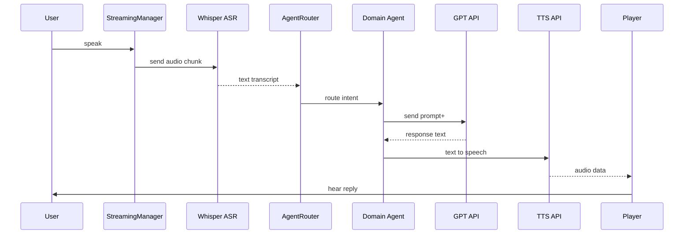

# Visual Architecture Diagrams

This document contains illustrative diagrams to help newcomers understand the core structure and data flows of the voice-to-voice financial services assistant.

---

## 1. Component Diagram
```mermaid
flowchart TD
    subgraph Voice Processing
      A[Microphone Input] --> B[StreamingManager]
      B --> C[Whisper ASR]
      C --> D[Text Transcript]
    end

    subgraph Agent System
      D --> E[AgentRouter]
      E --> F[BankingInfoAgent]
      E --> G[PaymentsAgent]
      E --> H[FraudAgent]
      E --> I[IDVAgent]
    end

    subgraph LLM & TTS
      F & G & H & I --> J[GPT API]
      J --> K[TTS API]
      K --> L[Audio Playback]
    end

    style Voice Processing fill:#f9f,stroke:#333,stroke-width:1px
    style Agent System    fill:#ff9,stroke:#333,stroke-width:1px
    style LLM & TTS       fill:#9ff,stroke:#333,stroke-width:1px
```

---

## 2. Sequence Diagram (User Interaction)


---

## 3. Data Flow Diagram

```mermaid
flowchart LR
    Audio[Audio Stream]
    Audio -->|VAD| StreamingManager
    StreamingManager --> Whisper[Whisper ASR]
    Whisper --> Transcript[Text Transcript]
    Transcript --> Router[AgentRouter]
    Router --> Agent[Domain Agent]
    Agent --> GPT[GPT API]
    GPT --> TTS[TTS API]
    TTS --> AudioPlayer[Audio Playback]

    classDef external fill:#eee,stroke:#999;
    class Whisper,Router,Agent,GPT,TTS external;
```


---

_Ensure your Markdown viewer supports Mermaid diagrams. Update these diagrams as the architecture evolves._
